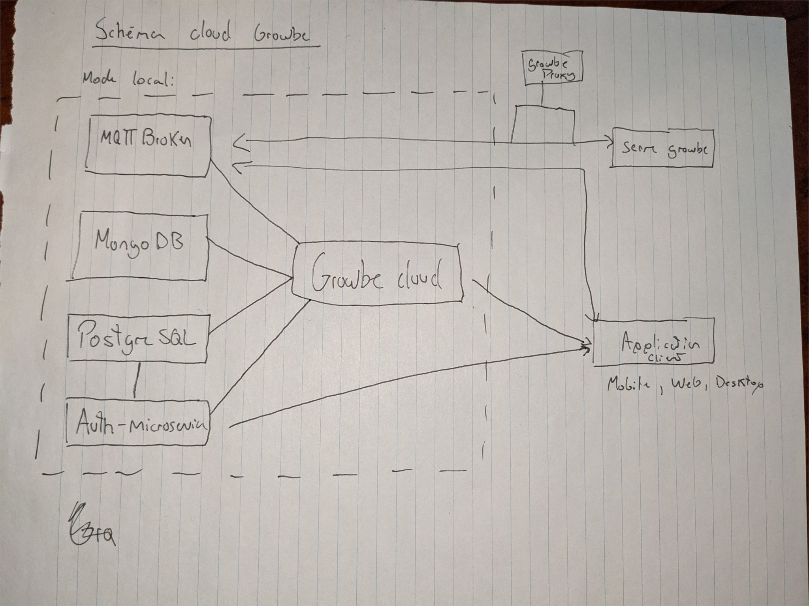

# Fonctionnement Growbe Cloud

;

Éléments qui forme le cloud:

* ***MQTT Broker*** : Pour relayé les messages entre les serres, le système et les usagers.
* ***MongoDB*** : Base de donnée NoSQL qui sera utilisé pour sauvegarder les données de sensor des différentes serres
* ***PostgreSQL*** : Base de donnée SQL qui est utilisé pour stocker les données des utilisateurs et les configurations des serres.
* ***Auth microservice*** : Backend qui s'occupe de l'authentification, de l'authorization, gestion des usagers et gestion des organisations. (nodejs lb4)
* ***Growbe cloud*** : Backend qui expose les données des serres et permet de faire des manipulations sur les serres. (nodejs lb4)
* ***Growbe portal*** : Application Web , Mobile et Desktop pour faire la gestion et voire les données de nos serres. (angular)
* ***Serre growbe*** : Le board
* ***Growbe proxy*** : Proxy qui permet de connecter le growbe a un ordinateur pour qu'il se connecter au broker MQTT.